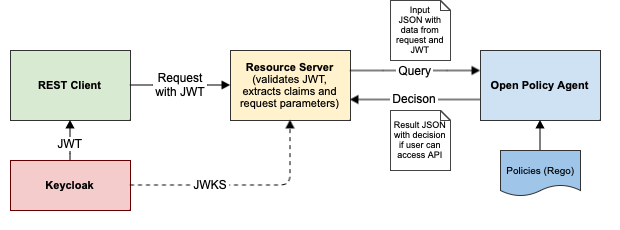

# Authorization with Open Policy Agent and Keycloak
This project studies the securing of the REST API of a Spring Boot resource server
with [Open Policy Agent](https://www.openpolicyagent.org) (OPA) as authorization server
and [Keycloak](https://www.keycloak.org) as authentication server.

## Overview
Although authentication and authorization can be combined (see for example [Keycloak's authorization services](https://www.keycloak.org/docs/latest/authorization_services/)),
there is a recent trend to separate them. Another trend is to move the evaluation of authorization rules outside the resource server.
The complete setup for protecting a REST API therefore consists of three services and and a REST client:




The workflow for authenticating and authorizing a REST request consists of the following steps: 
1. On startup, the resource server retrieves the [JWK Set](https://datatracker.ietf.org/doc/html/rfc7517) needed for JWT validation from Keycloak.
2. The REST client (curl) obtains a JWT for the user from Keycloak using the [OAuth 2 password grant](https://oauth.net/2/grant-types/password/).
3. The REST client accesses the REST API, passing the JWT as `Bearer` token.
4. The resource server validates the JWT and extracts the required information (e.g. user roles).
5. Using data from the JWT and the request, the resource server builds an [input document](./rego/demo-body.json) for OPA.
6. The resource server queries OPA, passing the just built input document as JSON POST body.
7. Given the query path and input data, OPA evaluates the [corresponding rules](./rego/demo-rules.rego) and comes to a decision.
8. OPA returns the decision as JSON document.
9. The resource server extracts the decision from the result and grants or denies the access to the endpoint.

## System Requirements
You need local installations of
* Docker Compose
* Curl

## Run the Servers
```shell
docker compose up
```
This starts Keycloak (with a [predefined realm](./keycloak/demo-realm.json)),
OPA (with a [rule set](./rego/demo-rules.rego)), and the resource server.

## Curl the REST API
Folder [scripts](./scripts) contains a number of shell scripts that first obtain a JWT from Keycloak
and then query the REST API of the resource server. Example calls:

```shell
sh scripts/get-teams.sh
sh scripts/post-team.sh
```

## Play with OPA
For development and testing, the OPA service can be used separately.
It has an "eval" mode that allows the testing of rule sets (written in OPA's [Rego language](https://www.openpolicyagent.org/docs/latest/#rego)):

```shell
docker run --rm -v $(pwd)/rego:/rego openpolicyagent/opa eval -i /rego/demo-input.json -d /rego/demo-rules.rego data.demo.allow./opa eval -i demo-input.json -d demo-rules.rego data.demo.allow
```
OPA can also run as server:
```shell
docker run --rm -v ${PWD}/rego:/rego -p 8181:8181 openpolicyagent/opa run --server --addr :8181 /rego/demo-rules.rego
```
It can then be queried with a REST call, just as the resource server does: 
```shell
curl -H 'Content-Type: application/json' localhost:8181/v1/data/demo/allow -d @rego/demo-body.json
```
