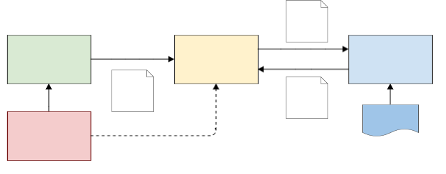

# Authorization with Open Policy Agent and Keycloak
This project studies the securing of the REST API of a Spring Boot resource server
with [Open Policy Agent](https://www.openpolicyagent.org) (OPA) as authorization server
and [Keycloak](https://www.keycloak.org) as authentication server.

Be sure to check out the corresponding Medium article: [Externalize your API Protection!](https://medium.com/@torsten.schlieder/externalize-your-api-protection-edc720e64f2d)

## Authorization Overview
Although authentication and authorization can be combined (see for example [Keycloak's authorization services](https://www.keycloak.org/docs/latest/authorization_services/)),
there is a recent trend to separate them. Another trend is to move the evaluation of authorization rules outside the resource server.
A complete setup for protecting a REST API therefore consists of three services and a REST client:



The workflow for authenticating and authorizing a REST request consists of the following steps: 
1. On startup, the resource server retrieves the [JWK Set](https://datatracker.ietf.org/doc/html/rfc7517) needed for JWT validation from Keycloak.
2. The REST client ([curl](https://curl.se)) obtains a JWT for the user from Keycloak using the [OAuth 2 password grant](https://oauth.net/2/grant-types/password/).
3. The REST client accesses the REST API, passing the JWT as `Bearer` token.
4. The resource server validates the JWT and extracts the required information (e.g. user roles).
5. Using data from the JWT and the request, the resource server builds an [input document](./rego/demo-body.json) for OPA.
6. The resource server queries OPA, passing the just built input document as JSON POST body.
7. Given the query path and input data, OPA evaluates the [corresponding rules](./rego/demo-rules.rego) and comes to a decision.
8. OPA returns the decision as JSON document.
9. The resource server extracts the decision from the result and grants or denies the access to the endpoint.

The figure also shows that there is no technical dependency between Keycloak and OPA.
Also (and fortunately), OPA does not need to know anything about the users managed by Keycloak.
Keycloak passes all required user information in (custom) JWT claims, especially the user's roles and group memberships.

## Authorization Details
Assume that the resource server manages information about sports teams.
A user wants to modify details of team 123.
After authentication with Keycloak, the API client obtains a JWT which, among other information,
contains the following claims (step 2):  
```json
{
  "roles": ["analyst"],
  "groups": ["Team123"]
}
```
The JWT is passed as `Bearer` JWT to the resource server (step 3): 
```
PUT http://localhost:8090/teams/123
```
The resource server builds the following input JSON for OPA (steps 4 and 5)
```json
{
  "input": {
    "method": "PUT",
    "path": "/teams/123",
    "roles": ["analyst"],
    "groups": ["Team123"]
  }
}
```
and sends it to OPA as `POST` body of the following request (step 6):
```
http://localhost:8181/v1/data/demo/allow
```

The rule set evaluated by OPA in step 7 is:
```rego
package demo

import future.keywords.if
import future.keywords.in

# The default value is used when all rules with the same name are undefined
default allow := false

# Members of a team have read+write access to the data of (only) that team
allow if {
    input.method in {"GET", "PUT"}
    teamId := trim_prefix(input.path, "/teams/")
    teamName := concat("", ["Team", teamId])
    teamName in input.groups
}

# Users with "api-read" rights can read the data of all endpoints
allow if {
    input.method == "GET"
    "api-read" in input.roles
}

# Users with "api-full" rights have full access to all endpoints
allow if {
    "api-full" in input.roles
}
```
Because the "team membership" rule matches, OPA returns the following JSON result (step 8):
```json
{
  "result": true
}
```
This lets the resource server grant access to resource `/teams/123` (step 9).

## System Requirements
You need local installations of
* Docker Compose
* Curl

## Run the Servers
```shell
docker compose up
```
This starts Keycloak (with a [predefined realm](./keycloak/demo-realm.json)),
OPA (with a [rule set](./rego/demo-rules.rego)), and the resource server.

## Curl the REST API
Folder [scripts](./scripts) contains a number of shell scripts that first obtain a JWT from Keycloak
and then query the REST API of the resource server. Example calls:

```shell
sh scripts/get-teams.sh
sh scripts/post-team.sh
```

## Play with OPA
For development and testing, the OPA service can be used separately.
It has an "eval" mode that allows the testing of rule sets (written in OPA's [Rego language](https://www.openpolicyagent.org/docs/latest/#rego)):

```shell
docker run --rm -v $(pwd)/rego:/rego openpolicyagent/opa eval -i /rego/demo-input.json -d /rego/demo-rules.rego data.demo.allow
```
OPA can also run as server:
```shell
docker run --rm -v ${PWD}/rego:/rego -p 8181:8181 openpolicyagent/opa run --server --addr :8181 /rego/demo-rules.rego
```
It can then be queried with a REST call, just as the resource server does: 
```shell
curl -H 'Content-Type: application/json' localhost:8181/v1/data/demo/allow -d @rego/demo-body.json
```
